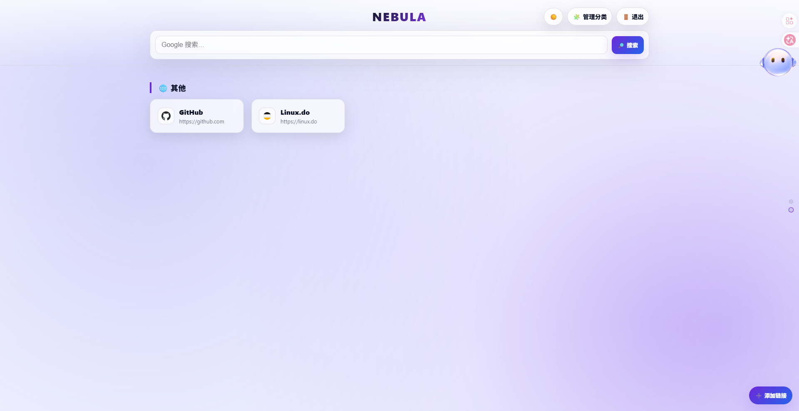

# 🚀 NEBULA — Cloudflare Worker Personal Dashboard

<p align="center">
  
  
  
</p>

一个基于 Cloudflare Workers 构建的个人导航控制台：**极简、可自助配置、支持拖拽排序**，并且默认带登录保护。

无需服务器、无需数据库，使用 Cloudflare KV 在边缘存储你的分类与链接，免费部署属于你的个人入口。

> **Demo / 预览**
>
> 

---

## ✨ 项目亮点

- **⚡ Serverless 架构**：部署在 Cloudflare Workers，边缘节点就近访问。
- **🔒 登录保护 + 强制改密**：
  - 首次登录默认账号：`admin / admin123456`
  - 登录后会进入“修改密码”页，密码以 **SHA-256 哈希**保存到 KV（不会在代码里明文出现）。
- **🧠 自助配置（无需改代码）**：
  - 在页面内新增/编辑/删除链接
  - 支持“新建分类”，并可随时重命名
  - 图标自动同步（favicon）
- **🖱️ 交互体验**：
  - 鼠标滚轮切换分类（像翻页一样）
  - 分类排序（管理面板拖拽）
  - 链接拖拽排序、跨分类拖拽移动
- **🌗 亮色/暗色主题**：一键切换并记住偏好（localStorage），默认跟随系统。

---

## 🚀 快速部署（Copy & Paste）

你不需要安装任何本地环境，只需浏览器即可完成部署。

### 1) 创建 Worker

1. 登录 Cloudflare 控制台
2. 左侧：**Workers & Pages → Overview → Create Application → Create Worker**
3. 取一个名字（例如 `nebula`）点击 **Deploy**
4. 点击 **Edit code**
5. 把仓库里的 `worker.js` 全部复制粘贴覆盖
6. **先不要急着 Deploy**，继续做 KV/Secret 配置（下面两步）

---

## 🧱 必需配置（KV + Secret）

本项目依赖：

- KV 命名空间：`LINKS`（存储分类与链接）
- KV 命名空间：`AUTH`（存储登录账号与密码哈希）
- Secret：`SESSION_SECRET`（签名 Cookie Session）

### 2) 创建 KV 命名空间

Cloudflare 控制台 → **Storage & Databases → KV** → Create a namespace

创建两个：

- `nebula_links`
- `nebula_auth`

### 3) 绑定 KV 到 Worker

回到：**Workers & Pages → 你的 Worker → Settings → Variables**

找到 **KV Namespace Bindings**，新增两条：

| Binding name | KV Namespace |
|---|---|
| `LINKS` | `nebula_links` |
| `AUTH`  | `nebula_auth` |

> 绑定名必须是 `LINKS` / `AUTH`（代码里固定用这个）

### 4) 设置 SESSION_SECRET

同页面（Variables）找到 **Secrets** → Add secret：

- Name: `SESSION_SECRET`
- Value: 随便一串强随机（建议 32+ 位）

你可以用任意方式生成；比如直接在浏览器控制台生成也行：

```js
crypto.getRandomValues(new Uint8Array(32))
```

✅ 部署上线

完成以上配置后，回到在线编辑器右上角点击 Deploy。

访问你的 Worker 地址即可使用。

🔑 默认账号密码（首次）

用户名：admin

密码：admin123456

首次登录会强制进入“修改密码”页面，修改后才会进入控制台。

🧭 使用指南（部署后怎么玩）

添加链接：右下角 ➕

你可以在“新建分类”输入分类名，会自动创建分类

图标留空会自动同步 favicon

编辑/删除：鼠标移到卡片右上角的小按钮

拖拽排序：

链接卡片可拖拽排序，也可拖到别的分类

分类排序：点击右上角「🧩 管理分类」并拖动排序

切换分类：鼠标滚轮上下滚动（也可点击右侧圆点）

亮/暗切换：右上角 🌙/☀️

📁 项目结构
.
├─ worker.js                 # Worker 主文件（部署复制这一个就行）
└─ screenshots/
   └─ preview.png            # 预览图（可选）

🛡️ 安全说明

密码不会写在代码里；修改后以 SHA-256 哈希保存到 AUTH KV

Session 使用 SESSION_SECRET 做 HMAC 签名，避免伪造

Cookie 设置 HttpOnly + SameSite=Lax + Secure

📄 License

MIT
